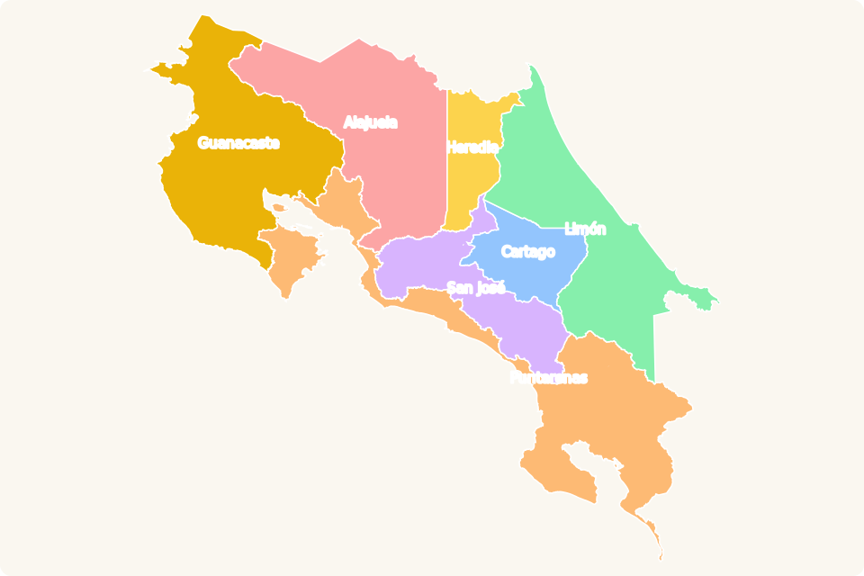

# Explora Costa Rica 🇨🇷

Interactive, animated map of Costa Rica's **7 provinces, 84 cantons, and 494
districts**. A free social-service and learning project — open data, open
source, zero hosting cost.

**Live:** https://explora-cr.vercel.app



## Features

- **Animated drill-down** — click a province and the camera zooms in as its
  cantons draw themselves in; click a canton to reveal its districts. Any
  district is reachable in three clicks.
- **Every view is a URL** — all ~585 region pages are statically generated
  and shareable (`/alajuela/grecia/tacares`).
- **Cmd+K search** — fuzzy, accent-insensitive search over every region;
  selecting a result flies the camera there.
- **"¿Cuál es este cantón?"** — a quiz mode ([/juego](https://explora-cr.vercel.app/juego))
  that shows a highlighted canton and four choices. The educational star
  feature.
- **ES/EN toggle**, dark mode, `prefers-reduced-motion` fallbacks, and an
  accessibility pass (keyboard-navigable map regions, labeled landmarks).
- **Curated canton facts** — hand-verified tidbits on canton pages
  (see [data/facts](data/facts/README.md); contributions welcome).

## Stack

| Layer     | Choice                                                    |
| --------- | --------------------------------------------------------- |
| Framework | Next.js (App Router, `output: "export"`) + TypeScript     |
| Map       | D3 (`d3-geo`, `d3-zoom`) + TopoJSON                        |
| Animation | Motion + D3 transitions + CSS keyframes                    |
| Styling   | Tailwind CSS 4                                             |
| State     | URL params (selection) + Zustand (ephemeral UI only)       |
| Search    | Fuse.js                                                    |
| Data      | IGN SNIT WFS (official district boundaries), simplified with mapshaper |
| Hosting   | Vercel (plain static site)                                 |

## Getting started

```bash
pnpm install
pnpm run dev        # http://localhost:3000
```

Other commands:

```bash
pnpm run build       # static export (out/)
pnpm run lint         # eslint
pnpm run validate      # data-integrity checks (counts, slugs, topo consistency)
pnpm run build:topo     # regenerate all data from the IGN WFS source
pnpm exec tsx scripts/render-map-svg.mts   # regenerate docs/mapa.svg
```

## Architecture in one paragraph

The URL is the only source of truth: every view is a statically generated
page, and the map camera is driven exclusively by route changes — clicking a
region just `router.push`es, and one effect zooms to the new bounds, so
clicks, breadcrumbs, the back button, search, and direct links all animate
through the same code path. React mounts the SVG paths; D3 owns only the
zoom transform. Only the active province's cantons and the active canton's
districts are ever mounted. See [PLAN.md](PLAN.md) for the full design and
[CLAUDE.md](CLAUDE.md) for working conventions.

## Data

Boundaries come from the **Instituto Geográfico Nacional** via the SNIT's
official WFS service (1:5000 district layer), simplified to ~445 KB of
TopoJSON whose three layers share arcs. Names, codes, the hierarchy, slugs,
and areas are all derived from that single source by
[`scripts/build-topo.mts`](scripts/fetch-geo.md). The divisions data is
current as of 2025 (84 cantons, including Monteverde and Puerto Jiménez).

## Contributing & license

Contributions welcome — see [CONTRIBUTING.md](CONTRIBUTING.md). Canton facts
are curated by hand; please cite a source. Licensed under
[MIT](LICENSE).
